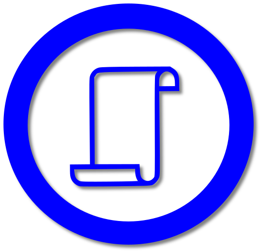

# ReGO - Research that moves
<p align="center">
 
</p>

### About
A Cross-platform Mobile Application to Read Research Articles on the Go

### Summary
The availability of biomedical literature has increased in the last decade, PubMed holds about
30 million papers with an additional million papers added annually. However, the enormous
resources being produced make it hard to find relevant documents from databases, without
the right skillset, traditional databases like PubMed might seem difficult to use. The REGO
mobile application is designed to provide research papers to users in real-time, with a
graphical user interface designed with React Native and functionality provided through Node
JS and Mongo DB, it uses GraphQl as the middleware, data is retrieved from NCBI using E-
search and E-summary, from NCBI E-Utilities API. REGO can: recommend papers based on
user’s keywords; run queries; allow the user to save favourite papers; provide abstracts and
produce full-text publications, if they have open access. REGO is also equipped to store user
data information and preferences in the local application state using Redux, this ensures a
more personalised user experience.

### Workflow and Implementation
<p align="center">
 
</p>

1. Frontend (user-interface) built with  [React](https://reactjs.org/) and [React Native](https://reactnative.dev/)
2. Backend (web-server) built with Javascript
3. [Graphql](https://graphql.org/) used as an API to connect the frontend and backend
4. [MongoDb](https://docs.mongodb.com/manual/) used as a Database of choice
5. Research papers to be obtained using the NCBI’s [Entrez utils](https://www.ncbi.nlm.nih.gov/books/NBK25501/) API.

### Availability 
The packaged android version 1.0 of the application is available for download [here](https://install.appcenter.ms/users/totodingi/apps/rego/distribution_groups/beta%20testers).

To package your own version of the application: 
1. Set up a react native development environment using [this](https://reactnative.dev/docs/environment-setup#:~:text=Creating%20a%20new%20application) guide
2. Clone the repository locally and navigate into the Rego directory in the frontend directory and run the following commands
```shell
cd ./src/frontend/Rego

npm install 

npx react-native run-android # for debug mode android application

npx react-native run-ios  # for debug mode iOS application 

npx react-native run-android --variant=release # for production ready android application 

npx react-native run-ios --variant=release # for production ready ios application
```

### ReGO in Action
<div align="center"  style="display: flex">
    
    
    
</div>

<div align="center" style="display:flex">
    
    
    
</div>

### Project organization
[rego](./README.md) <br>
- [Docs](./docs):
  - Contains project documentation and wiki files 
- [Output](./output):
  - Contains the screen-captures of the rego app in use
- [Scripts](./scripts):
  - Contains utility scripts for the project
- [Src](./src):
  - Contains the source code of the application
  - Subdivided into 2 directories (Frontend and Backend)
  - The [Frontend](./src/frontend) directory contains the user interface code
  - The [Backend](./src/backend) directory contains the server code for the application
- [Workflow](./workflow):
  - Contains the workflow and implementation description of the project

### Meet the team
1. [Wilson Mudaki](https://github.com/totodingi)
- Affiliation:
  - Bioscience Research Center,Pwani University, P.O. Box 195-80108, Kilifi, Kenya
- Roles/Contribution:
  - Team lead
  - Technical lead

2. [Dele-Alimi Temiloluwa]()
- Affiliation:
  - Public Health Biotechnology Unit, Institute of Child Health, University of Ibadan, Ibadan, Nigeria
- Roles/Contribution:
  - Lead writer
  - Team co-lead

3. [Julius Mwakosya]()
- Affiliation:
  - Molecular Biology and Biotechnology Department, University of Dar es salaam
- Roles/Contribution: 
  - Technical contribution
